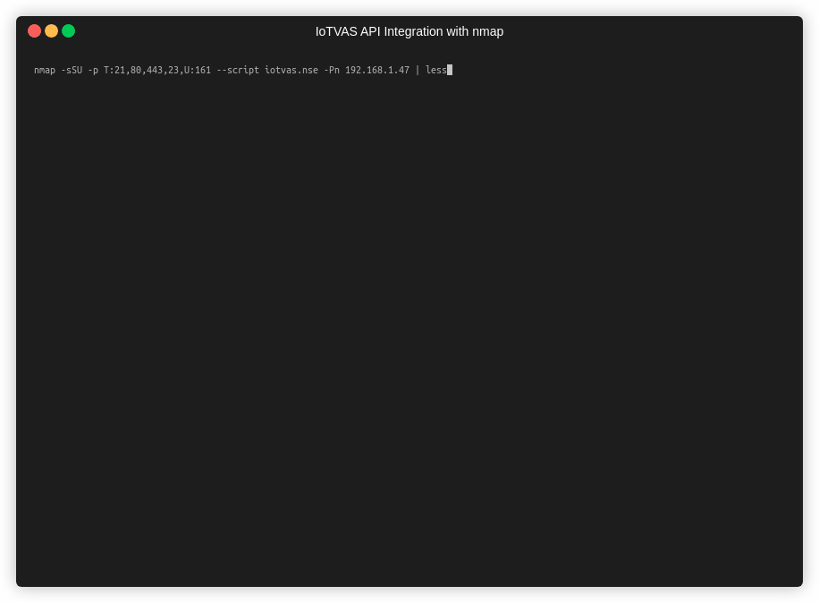

# Introduction

This repository hosts a NSE script that uses [IoTVAS API](https://iotvas-api.firmalyzer.com/api/v1/docs) for IoT device discovery and firmware security assessment. This [blog post](https://firmalyzer.com/posts/connected_device_discovery_and_vulnerability_assessment.html) provides more details about the script and IoTVAS API.

# Installation

Copy the iotvas.nse file to the nmap scripts folder on your system:

    cp iotvas.nse /usr/share/nmap/scripts

Then, test if script is recognized by nmap:

    nmap --script-help iotvas

# API key

Please visit the [IoTVAS signup page](https://iotvas-api.firmalyzer.com/portal/signup) to get a free trial API key.

# Usage

The API key should be supplied in the nmap script arguments as follows:

    nmap -sSU -p U:161,T:- --top-ports 1000 --script iotvas.nse --script-args iotvas.api_key=<API_KEY> <target>

We recommend the use of nmap TCP SYN and TCP connect scans when running IoTVAS script. You can specify a TCP port range other than the top 1000 ports to speed up nmap. However, please note the following: 

- UDP port range should include 161/udp, so the script can get snmp features of the device
- Some of IoT devices expose their web-based management UIs on high port numbers (> 1024) which if missing from your specified port range, would result in the device not being detected by the script.

Output results can be saved to a text or xml file using the nmap -oN or -oX command line parameters.

# Example

The following figure demonstrates how iotvas script enables nmap to accurately detect the maker, model, firmware version of an enterprise printer, along with its known CVEs and firmware risk assessment report.

